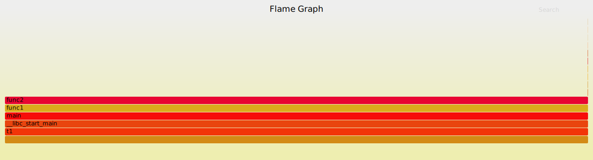

## Perf简介  
Perf是linux系统自带的一个专业性能分析工具，由linux内核在2.6.31里引入，起初称为Performance Counters for Linux，简称PCL。随着功能的不断加强，Perl能够分析和处理几乎所有性能相关的事件（例如CPU时钟、IO请求等），随后被正式更名为Linux Perf Events（LPE）。
  
Perl基于事件采样原理，以性能事件为基础，支持针对处理器相关性能指标与操作系统相关性能指标的性能剖析。可用于性能瓶颈的查找与热点代码的定位。不过，对于系统级优化来说，Perl只完成了其中的一个环节，另外一个环节是对热点代码进行分析和优化，因此最终的优化效果严重依赖开发者的实际优化经验。  

针对Perl的介绍，网络上的信息已经比较全面，本文档主要参考和整理了其中比较有价值的文章，并对常用的命令进行介绍，目的在于指导开发者快速进行系统级的性能分析。更加详细的Perf介绍可以参照[wiki](https://perf.wiki.kernel.org/index.php)。  
## Perf安装  
* **源码安装**     
cd /usr/src/kernels/tools/perf/  
make && make install  
* **yum安装**  
yum install -y perf.x86_64  

## Perf常用命令
Perf工具本身的功能很强大，但是对于大多数项目来说，我们只需要关注以下常用的命令即可，它们分别为perf top、perf stat、perf record和perf report。  

* **perf top**  
	
	对于一个指定的性能事件(默认是CPU周期)，显示消耗最多的函数或指令。  

	``` 
	System profiling tool.

	Generates and displays a performance counter profile in real time.

	perf top [-e <EVENT> | --event=EVENT] [<options>]
	```
* **perf stat**  
	
	用于分析指定程序的性能概况。  

	```
	Run a command and gather performance counter statistics.

	perf stat [-e <EVENT> | --event=EVENT] [-a] <command>

	perf stat [-e <EVENT> | --event=EVENT] [-a] - <command> [<options>]
	```
* **perf record**  
	
	收集采样信息，并将其记录在数据文件中。
	随后可以通过其它工具(perf-report)对数据文件进行分析，结果类似于perf-top的输出。  

	```
	Run a command and record its profile into perf.data.

	This command runs a command and gathers a performance counter profile from it, 	into perf.data,

	without displaying anything. This file can then be inspected later on, using 	perf report.
	```
* **perf report**  
	
	读取perf record创建的数据文件，并给出热点分析结果。  

	```
	Read perf.data (created by perf record) and display the profile.

	This command displays the performance counter profile information recorded via 	perf record.
	```
##Perf实例  
	通过一个实际的列子来更加直观的说明Perf工具的性能分析过程。  

	编写以下测试代码，并生成可执行程序t1: 

	```
	void func2(long long cols)
	{
		for(long long i = 0; i < cols; i++)
		{
			long long tmp1 = i / 10000 + 1;
			long long tmp = tmp1 * (tmp1 + 1);
		}
	}

	void func1(long long rows, long long cols)
	{
		for(long long i = 0; i < rows; i++)
		{
			// do some other computation
			for(long long m = 0; m < 10000; m++)
			{
				long long tmp = m * (m + 1);
			}
			func2(cols);
		}
	}

	int main()
	{
		long long rows = 1000, cols = 100000000;
		func1(rows, cols);
		return 0;
	}
	```  
	上述代码很明显，func2中包含了计算最密集的那部分代码。  
	执行perf top命令同样会发现系统90%以上的CPU时间在执行func2。

	```
	perf top
	Samples: 7K of event 'cpu-clock', Event count (approx.): 1804957005
	Overhead  Shared Object       Symbol
  		92.72%  t1                  [.] func2
   		1.12%  [kernel]            [k] __do_softirq
   		0.55%  [kernel]            [k] _raw_spin_unlock_irqrestore
   		0.37%  [kernel]            [k] finish_task_switch
   		0.35%  [kernel]            [k] native_read_tsc
   		0.23%  perf                [.] __dso__load_kallsyms
   		0.19%  [kernel]            [k] number.isra.2
   		0.18%  [kernel]            [k] kallsyms_expand_symbol.constprop.1
   		0.18%  [kernel]            [k] tick_nohz_idle_enter
   		0.16%  [kernel]            [k] __memcpy
	```

	也可以执行perf stat ./t1来了解程序性能的概况  
	
	```
	perf stat ./t1
 	Performance counter stats for './t1':
 	
     234202.703074      task-clock (msec)         #    1.001 CPUs utilized
               521      context-switches          #    0.002 K/sec
                 0      cpu-migrations            #    0.000 K/sec
               256      page-faults               #    0.001 K/sec
   <not supported>      cycles
   <not supported>      instructions
   <not supported>      branches
   <not supported>      branch-misses

     233.888634032 seconds time elapsed
	```
	
	执行perf record收集采用信息，并生成数据文件perf.data。  
	
	```
	perf record -g ./t1 or perf record -g -p pid  
	[ perf record: Woken up 67 times to write data ]
	[ perf record: Captured and wrote 16.684 MB perf.data (198578 samples) ]
	-g 参数会生成函数的调用堆栈  
	```  
	执行perf report得到最终的性能分析报告。  
	
	```
	perf report >> result.txt
	cat result.txt  
	# To display the perf.data header info, please use --header/--header-only 		options.
	#
	#
	# Total Lost Samples: 0
	#
	# Samples: 198K of event 'cpu-clock'
	# Event count (approx.): 49644500000
	#
	# Children      Self  Command  Shared Object      Symbol
	# ........  ........  .......  .................  ......................................
	# 
	# 可以看出func2占用了99.92%，其它的main，func1占用很少，几乎为0,   
	# 因此对于t1来说，热点函数为func2，优化func2可以带来明显的性能提升。
    99.99%    99.92%  t1       t1                 [.] func2
            |
             --99.92%--__libc_start_main
                       main
                       func1
                       func2

    99.99%     0.00%  t1       t1                 [.] func1
            |
             --99.99%--func1
                       func2

    99.99%     0.00%  t1       t1                 [.] main
            |
            ---main
               func1
               |
                --99.99%--func2

    99.99%     0.00%  t1       libc-2.17.so       [.] __libc_start_main
            |
            ---__libc_start_main
               main
               func1
               |
                --99.99%--func2
	```
	只需要关注报告的前几项，就可以知道热点函数的CPU时间占用比例。 
	 
	如果你觉得上面perf自带的报告不够直观，可以借助网上的第三方脚本得到更加清晰的图形输出报告，第三方脚本地址[https://github.com/brendangregg/FlameGraph](https://github.com/brendangregg/FlameGraph)。  

	生成报告的执行步骤:  
	1、perf record -g ./t1 or perf record -g -p pid  
	2、perf script >> t1.perf  
	3、./stackcollapse-perf.pl t1.perf > t1.folded  
	4、./flamegraph.pl t1.folded > t1.svg  

	最终的输出报告  
	      
	
	##Perf总结  
	对于Linux系统下的性能剖析，Perf工具是非常实用的。借助Perf工具能够快速的定位热点函数，找出需要优化的代码片段。此外，Perf不仅仅可以用来分析计算密集型的程序(CPU BOUND), 还可以分析多线程应用程序的调度负载问题、锁管理优化和内核态的系统调用优化等。
